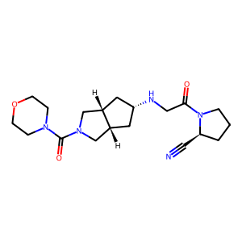

# CHEMBL284-GCN

<!--  -->
<figure>
  
  <figcaption>This is a molecule visualization of CHEMBL1082716</figcaption>
</figure>

## Overview

This project implements a **Graph Convolutional Network (GCN)** to predict molecular properties from the **CHEMBL284 dataset**. The dataset contains molecular structures represented as SMILES strings, which are converted into graph representations for input to the model. Each molecule is characterized by its nodes (atoms) and edges (bonds), enabling the use of graph-based deep learning techniques to model complex relationships.

The goal is to predict molecular properties such as **pIC50**, a logarithmic measure of the inhibitory concentration (IC50), which is a key metric in drug discovery.


## Key Features

- **Graph Representation**: Molecular graphs are generated from SMILES strings using RDKit. Nodes represent atoms, and edges represent chemical bonds.
- **GCN Architecture**: The model utilizes a stack of graph convolutional layers to extract structural information, followed by fully connected layers to make predictions.

- **Training Performance**: The model achieves a Mean Squared Error (MSE) loss of ***0.7489***, reflecting its effectiveness in predicting molecular properties.

## Dataset
- **Source**: The CHEMBL284 dataset, sourced from ChEMBL, includes molecular structures and their corresponding activity measurements.

- **Format**: SMILES strings are used to represent molecular structures, which are converted into graphs for model input.

## Running the code

#### Installing Dependencies
This model is run on Python 3.9. First you have to install all of the dependencies

```bash
pip install -r requirements.txt
```
#### Training the model 
When training the model, the weights will be saved at `weights` folder

```bash 
python install train.py
```

#### Web Interface
Launch the Gradio interface:

```bash
python gradio_app.py
```
